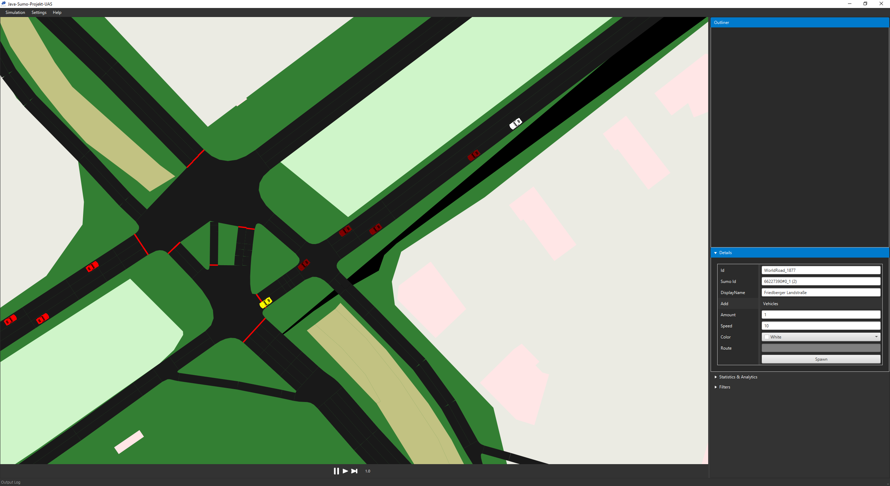

# Java Project WiSe 25 / 26, Group 3
A multithreaded*, GUI based, Java TraaS API wrapper,
which starts up a Sumo simulation and connects to it,
adding and removing objects from the Simulation in real
time.

_*To be implemented_

By Luca De Simone, Joel Stark and Leon Chimentchik.

## Features

- Visually Display SUMO Simulations
- Edit The SUMO Simulation
  - Inject & edit vehicles & routes
  - Control traffic lights
  - Interact with polygons around the map

## Dependencies

- [`Sumo`](https://sumo.dlr.de/docs/Installing/index.html "SUMO Documentation") - needed for TraaS
- [`Maven`](https://maven.apache.org "Apache Maven") - used for building the project
- [`Traas.jar`](https://sumo.dlr.de/javadoc/traas/index.html "TraaS Documentation") -
the core component of the program, used to start, edit and end the SUMO connection.

This automatically gets installed when you install SUMO on you device, or when you clone this repo. 

## Installation

Make sure to have SUMO installed and the environment variable SUMO_HOME set correctly. The TraaS API needs this.

First, you need to install the TraaS.jar library located in ./libs/TraaS.jar. This is done with

    mvn install:install-file -Dfile=libs/TraaS.jar -DgroupId=org.eclipse.sumo -DartifactId=traas -Dversion=1.0.0 -Dpackaging=jar

Start / compile using

    mvn clean javafx:run

or

    mvn clean install -U
    mvn exec:java

or, if you want a .jar file:

    mvn clean package

This creates 2 .jar's in /src/target, make sure move the one named *-with-dependencies.jar to the parent folder,
like showed in the file tree above.

Then, double-click the .jar or, inside the <code>target</code> folder, 

    java -jar JavaProjectWiSe2526-1.0-SNAPSHOT.jar

## Usage

### Start the Program

This can be done via compiling it with [maven](#Installation) or when double-clicking on the [.jar](#Installation) file.

### Start the Simulation

After the Window opens, navigate to the toolbar on the top and press

`Simulation` -> `Open...`

and select either a network (.net.xml) and route (.rou.xml) file, or a config (.sumocfg) file.

### Edit and View the Simulation

After the Simulation has loaded, you can play single steps with the Skip button at the bottom, or play the Simulation
with a given Speed with the Play button. The pause button pauses the simulation.

On the right side of the screen, you will find a lot of tools to edit the Simulation. Most of these require to select the element
you want to edit on the Map first.

